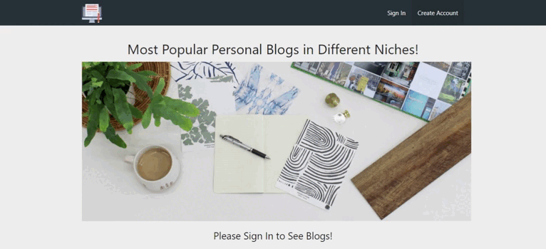
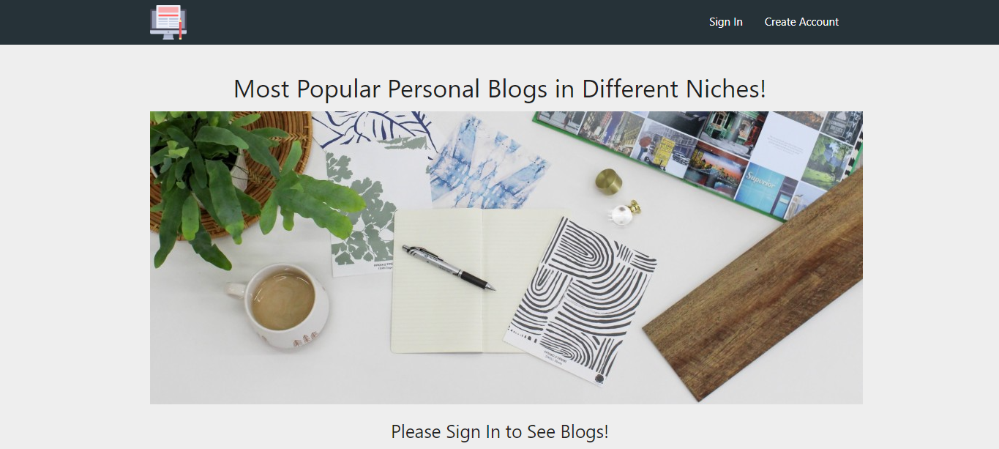
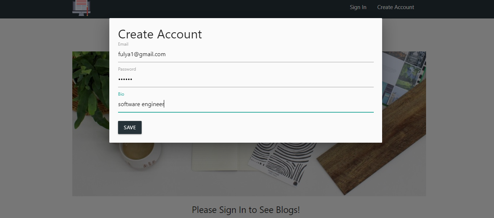
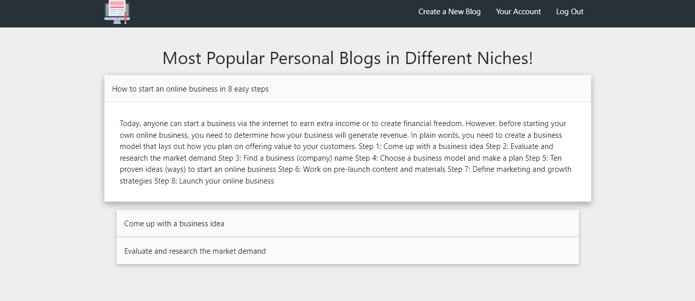
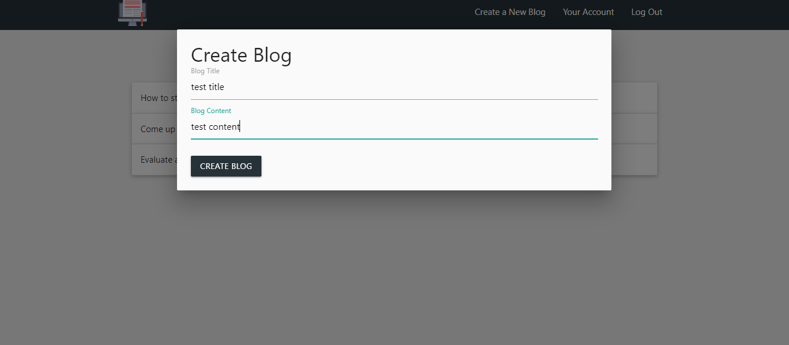

## Project: Mini Blog App

## Check The Live Website :arrow_right: [Live Website](https://mini-blog-website.netlify.app/)

## Animation of the App

- 

## Visulation of the App

- 

## Create an Account Screen
- 

## Logged In Screen
- 


## Created Blog Screen
- 


## Description
```bash

- Developed the blog application that it can be used to add/list blogs.

- Designed using Javascripts, HTML, Materialize CSS and Firebase.

- Users must sign in or create an account to use this website.

- User can see their personal informations(email and bio).

-When user sign in or create a blog, users' ang blogs' informations are stored on Firebase.
```


## Technologies 💻
```bash
- Html
- Javascript
- Materialize CSS
- Firebase Features(FireStore and Authentication)
```
## Note: You can use your own Firebase API creating a new project on [https://firebase.google.com/]
